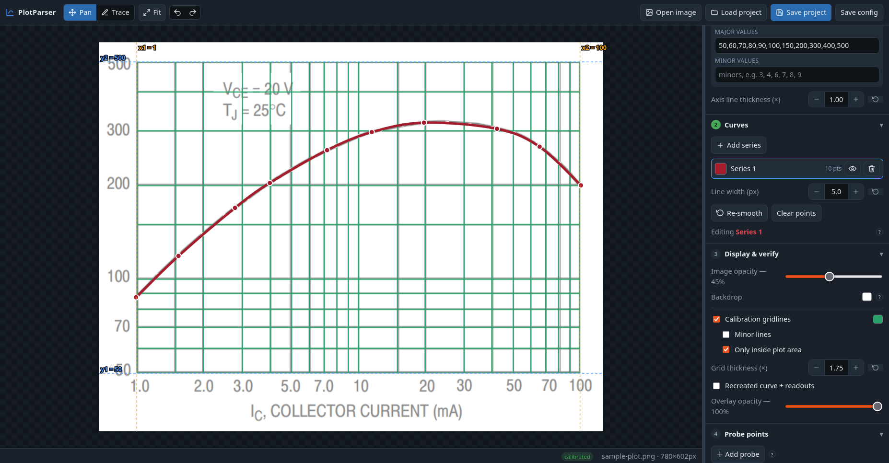

<h1 align="center">
  
</h1>

<div align="center">

**You found the exact curve you needed, buried in a datasheet, a textbook or some
decades-old paper. But it's a _picture_, and you need the _numbers_.**

**PlotParser gets the numbers back.**

### [Open the app](https://bocchio.github.io/plotparser/)

[](https://github.com/Bocchio/plotparser/actions/workflows/deploy.yml)
[](#run-locally)



</div>

---

 Load the image, show it where the axes are,
trace the line, export a CSV. Overlay the recreation to check it read the plot
the way you meant.

## How it works

Drop an image on the window, or paste, **Open image**, **Try sample**. Then
work down the panel:

1. **Calibrate:** drag the guide lines onto two known ticks per axis, type
   their values, pick Linear/Log.
2. **Trace:** click along the curve; the points smooth into a bézier you can
   refine like a pen tool. One series per curve.
3. **Verify:** fade the image, turn on the gridlines and the recreated curve.
   If they land on the original, the calibration's right.
4. **Probe:** drop pins that read the live (x, y); snap one to a curve to find
   where it meets an axis.
5. **Export:** CSV at an even grid, the calibration ticks, your own X list, or
   raw samples. Save the whole thing as a project to pick up later.

**Shortcuts:** `V` pan · `B` trace · `F` fit · `Ctrl/⌘+Z` undo · `A`/`S`/`C`
node type · `Delete` or `Ctrl-click` removes a node · wheel to zoom.

## Run locally

```bash
npm install
npm run dev      # localhost
npm run build    # -> dist/index.html, one self-contained file
```

Everything inlines into a single `index.html`. It runs on any static host, or
straight off disk (`file://`) with no server. The math core and the app itself
have end-to-end checks in `verify/`.

## Notes

- Axes are assumed aligned to the image (no rotation/skew), which is fine for
  typical scans. Projective 4-point calibration is future work.
- Export takes the first crossing for a value; multi-valued curves are future
  work too.

---

<div align="center"><sub>Completely vibe coded with Claude. Yes, this README too. &nbsp;</sub></div>
